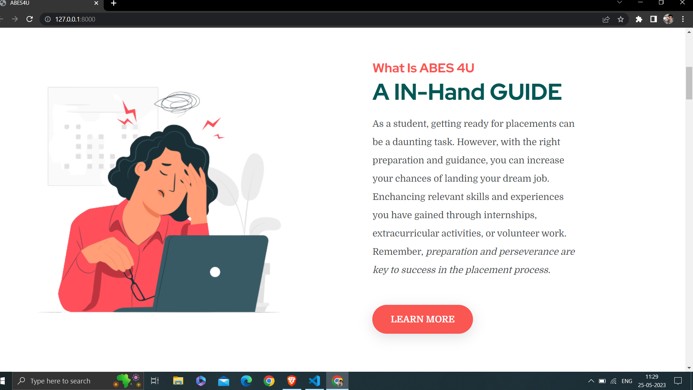
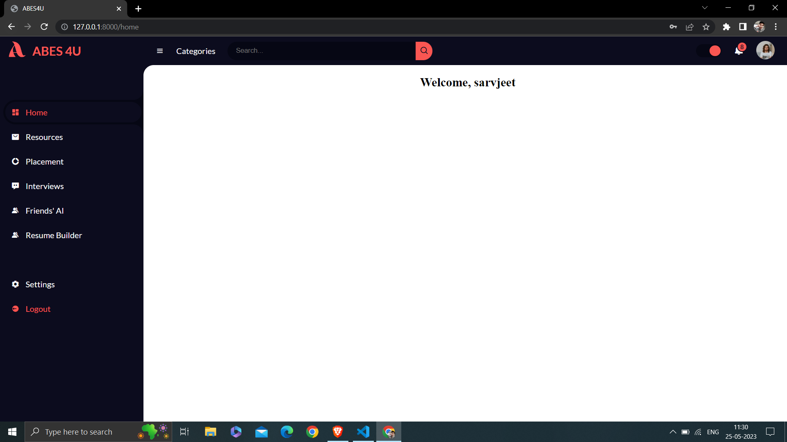
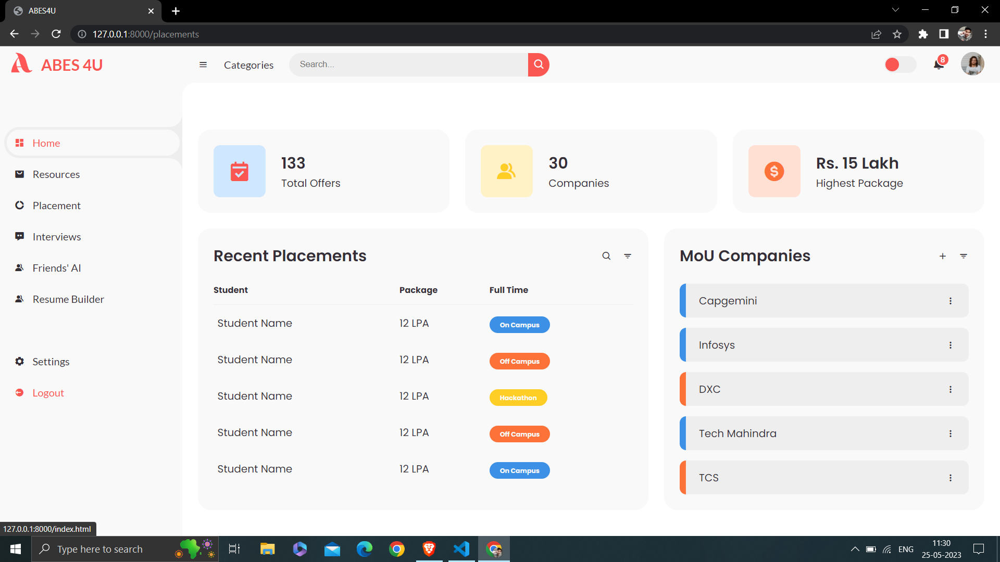
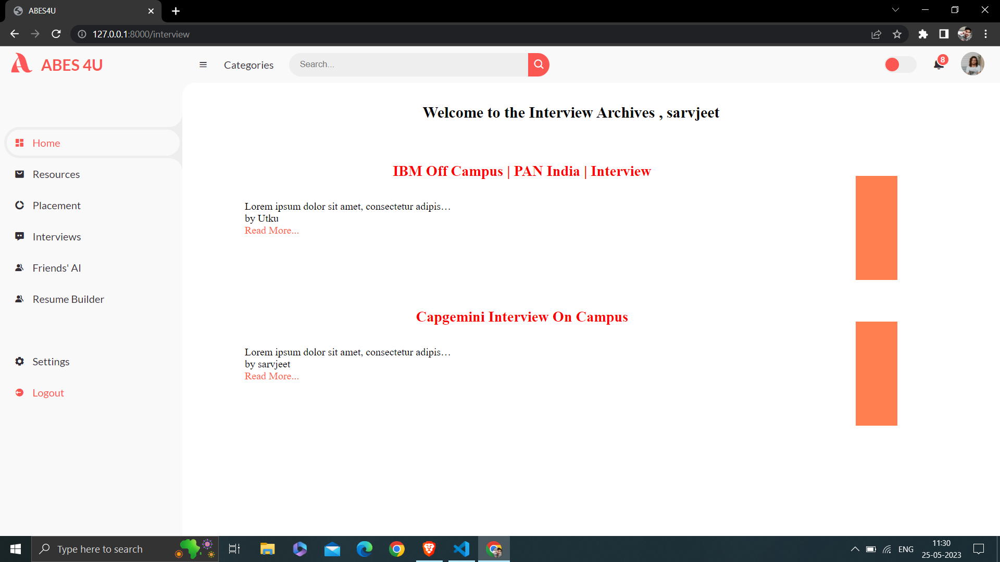
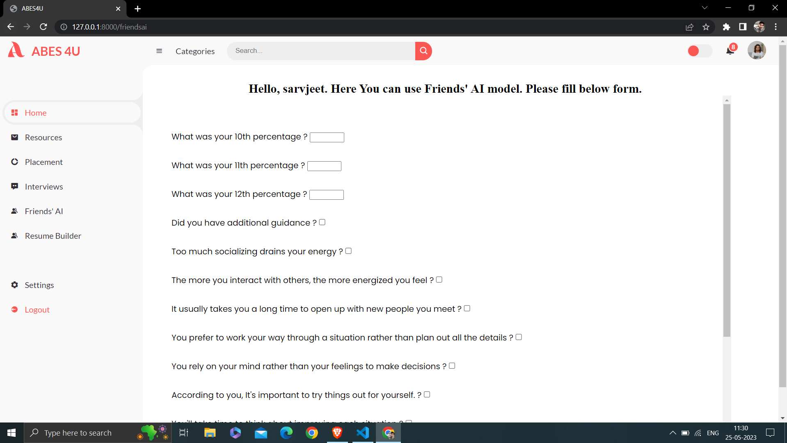

The sole purpose of this project is to develop a
method for providing personalized career guidance to a college
fresher.A web application called ABES4U has been developed
for ABES Engineering College in Ghaziabad. It provides comprehensive
career guidance to freshers who have a lot to explore
but very limited time.For this project, a survey was conducted
in computer science and allied branches at the college, focusing
on Computer Science Engineering students. The dataset contains
1000 data points along with 16 attributes.To provide career path
recommendations, a deep learning model called Friends AI was
developed. It takes both technical and personality attributes
as input parameters and suggests a career path based on the
experience of a senior student from the college. Additionally,
ABES4U has other features to ensure the overall grooming of
the college students. Ultimately, this research and ABES4U will
help them become industry-ready by the time they graduate. It is
suggested to implement this approach for core branches that are
not related to computer science as well. Hence, ABES4U will help
students to achieve more and perform better in their careers.

## Pictures of Application

;
;
;
;
;
;
;
